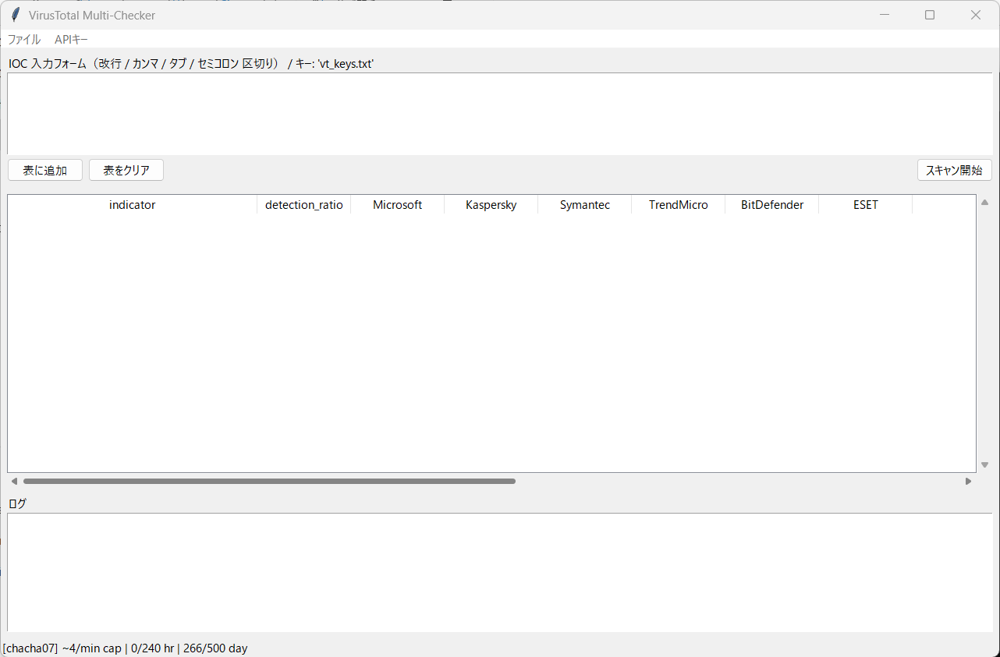

# VirusTotal Multi-Checker GUI 

## 概要
このツールは、複数の IOC（IPアドレス、ドメイン、ハッシュ値など）を VirusTotal（VT）で検索し、その結果を取得できる **GUIツール** です。

⚠ **注意**  
本ツールは **VirusTotal Public API** を使用しています。  
商用利用目的では使用できません。**個人利用** に限定して使用してください。



---

## 必要環境
- Python 3.x が動作する環境
- インターネット接続
- VirusTotal の無料アカウント

---

## インストールと実行方法

1. **必要なモジュールをインストール**
   ```bash
   pip install -r requirements.txt
   ```

2. **APIキーの設定**
   - プロジェクトフォルダ内の `vt_keys.txt` に、ご自身の VirusTotal 無料アカウントのユーザ名と API Key を記入してください。
   - 書式例：
     ```
     username,APIkey
     ```
     ※ `username,APIkeys` と書かれている部分を自身の情報に置き換えてください。

3. **ツールの起動**
   - `vt_keys.txt` を `vt_search_v0.0.1.py` と同じフォルダに配置した状態で、以下のコマンドを実行します。
     ```bash
     python vt_search_v0.0.1.py
     ```

---

## 使用方法

1. ツールを起動すると **GUI画面** が立ち上がります。
2. IOCフォームに IP、ドメイン、またはハッシュ値を直接入力するか、メニューバーの  
   **「ファイル」 → 「CSVから読み込み」** で IOC の一覧を読み込みます。
3. **「表に追加」** ボタンを押して、入力したIOCが表に反映されたことを確認します。
4. **「スキャン開始」** をクリックすると VirusTotal 検索が開始されます。
5. スキャン完了後、結果を保存したい場合は、  
   メニューバーの **「ファイル」 → 「結果をCSVに保存」** を選択して保存できます。

---

## ライセンス
本ツールは個人利用に限定して使用してください。商用利用は禁止されています。


---

# VT Search GUI Tool (English Version)

## Overview
This tool is a **GUI application** that searches multiple IOCs (IP addresses, domains, hash values, etc.) in VirusTotal (VT) and retrieves the results.

⚠ **Note**  
This tool uses the **VirusTotal Public API**.  
It cannot be used for commercial purposes and is limited to **personal use only**.

---

## Requirements
- Python 3.x environment
- Internet connection
- Free VirusTotal account

---

## Installation and Execution

1. **Install required modules**
   ```bash
   pip install -r requirements.txt
   ```

2. **Set your API key**
   - In the project folder, open `vt_keys.txt` and enter your VirusTotal **username** and **API Key** from your free account.
   - Example format:
     ```
     username,APIkey
     ```
     Replace the placeholder `username,APIkeys` with your own information.

3. **Run the tool**
   - Place `vt_keys.txt` in the same folder as `vt_search_v0.0.1.py`, then execute:
     ```bash
     python vt_search_v0.0.1.py
     ```

---

## Usage

1. When the tool starts, a **GUI window** will appear.
2. Enter IOC information (IP, domain, hash value) in the IOC form, or load an IOC list from a CSV file via  
   **"File" → "Load from CSV"** in the menu bar.
3. Click **"Add to Table"** to confirm the IOC is added to the table.
4. Click **"Start Scan"** to begin searching VirusTotal.
5. After the scan is complete, if you want to save the results, select  
   **"File" → "Save results to CSV"** from the menu bar.

---

## License
This tool is for **personal use only** and **commercial use is prohibited**.
